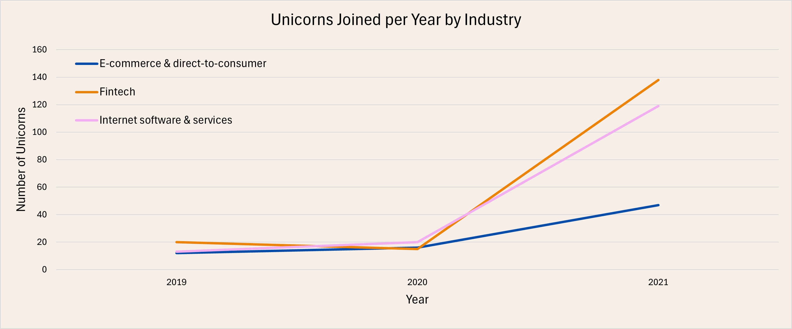
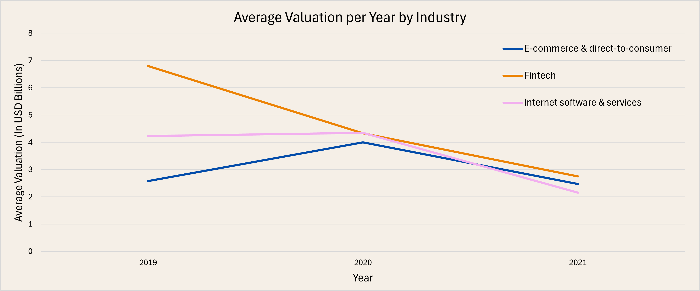
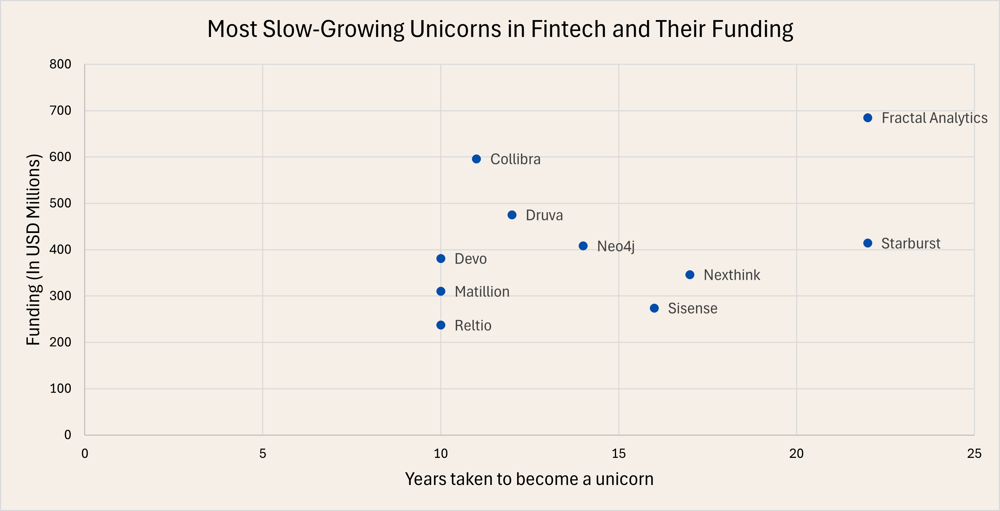
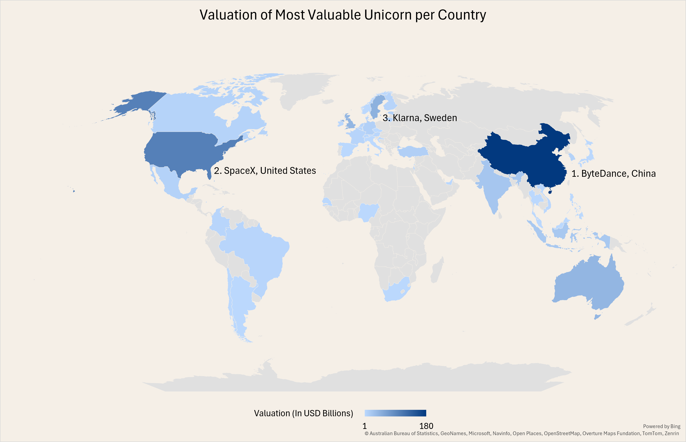
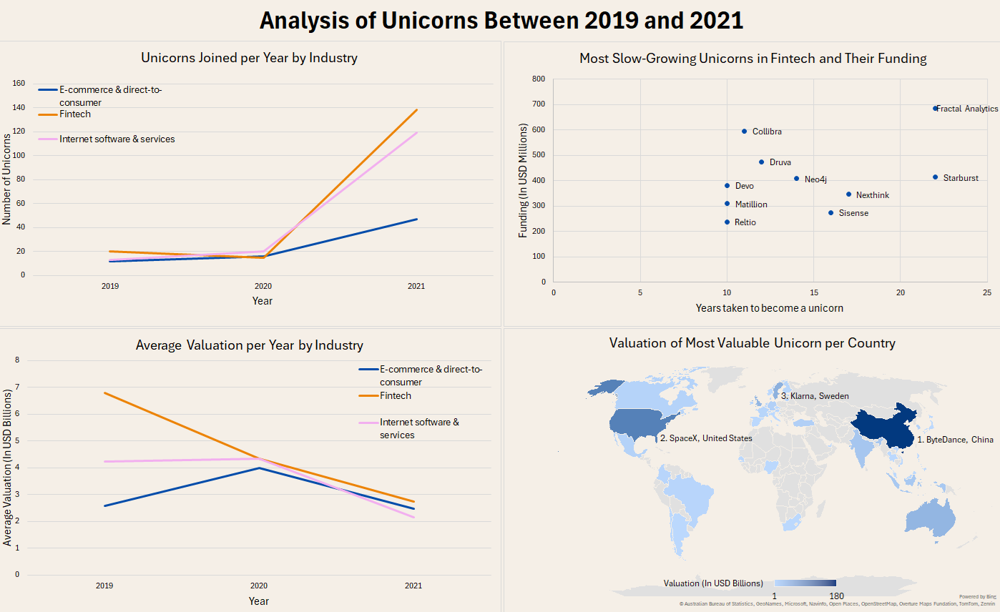

# Analyzing Unicorn Companies

A company is said to be a unicorn when its valuation grows above one billion dollars. The purpose of this project is to support an investment firm by analyzing trends in high-growth companies. They are interested in understanding which industries are producing the highest valuations and the rate at which new high-value companies are emerging. Providing them with this information gives them a competitive insight as to industry trends and how they should structure their portfolio looking forward.
There are three main questions that need to be answered:

1. For the three industries with more companies converted into unicorns between 2019 and 2021, what was the number of these unicorns and their average valuation for each year?
2. In the fintech industry, which companies that took more than 15 years to become a unicorn have the highest funding?
3. What's the most valuable unicorn for each country in the database? What's the valuation of that company?

The `unicorns` database contains the following tables:

### dates
| Column       | Description                                  |
|------------- |--------------------------------------------- |
| `company_id`   | A unique ID for the company.                 |
| `date_joined` | The date that the company became a unicorn.  |
| `year_founded` | The year that the company was founded.       |

### funding
| Column           | Description                                  |
|----------------- |--------------------------------------------- |
| `company_id`       | A unique ID for the company.                 |
| `valuation`        | Company value in US dollars.                 |
| `funding`          | The amount of funding raised in US dollars.  |
| `select_investors` | A list of key investors in the company.      |

### industries
| Column       | Description                                  |
|------------- |--------------------------------------------- |
| `company_id`   | A unique ID for the company.                 |
| `industry`     | The industry that the company operates in.   |

### companies
| Column       | Description                                       |
|------------- |-------------------------------------------------- |
| `company_id`   | A unique ID for the company.                      |
| `company`      | The name of the company.                          |
| `city`         | The city where the company is headquartered.      |
| `country`      | The country where the company is headquartered.   |
| `continent`    | The continent where the company is headquartered. |

## Analysis & Insights

After inspecting the integrity of the data in each table, we started creating the queries necessary for the job. Then imported the returned tables into Excel to create the visuals, starting with the analysis of the industries with more unicorns.

   

That's interesting, all three industries had 20 or fewer unicorns in both 2019 and 2020; however, in 2021, these numbers had a significant increase, being 138 for fintech, 119 for internet, and 47 for e-commerce, for an average growth of 552.5% in the last year. This increase has a direct impact on the average valuation of each industry since the great number of new unicorns with low valuations brings down their mean.

Next, we dug into the fintech industry to find their slowest-growing companies. The firm is interested in well-established businesses (more than 15 years) with funds larger than 300 million USD as a good alternative to invest in.

According to the recently mentioned preferences, there are three unicorns that stand out as an investment opportunity: Fractal Analytics, Starburst, and Nexthink.

Our last step is the segmentation by countries in order to find the most valuable unicorn for each one of them.

The entire list of unicorns per country can be found in `top_unicorn_by_country_table` in the `Tables` folder. However, we highlighted the top three: ByteDance in China, SpaceX in the United States, and Klarna in Sweden.

To conclude this project, we merged all the previous visuals in a dashboard for an easier view of the data.

## Conclusion

We can summarize all our work in three main bullet points:

1. The three industries with more unicorns between 2019 and 2021 were fintech, internet software & services, and e-commerce & direct-to-customer. All of them had a large increase in their number of unicorns in 2021, resulting in the drop of their average valuations.
2. Fractal Analytics, Starburst, and Nexthink are the best candidates for an investment based on the firm's preferences.
3. The countries with the most valuable unicorns are China, the United States, and Sweden. Their highest-valued unicorns are ByteDance, SpaceX, and Klarna, respectively.
